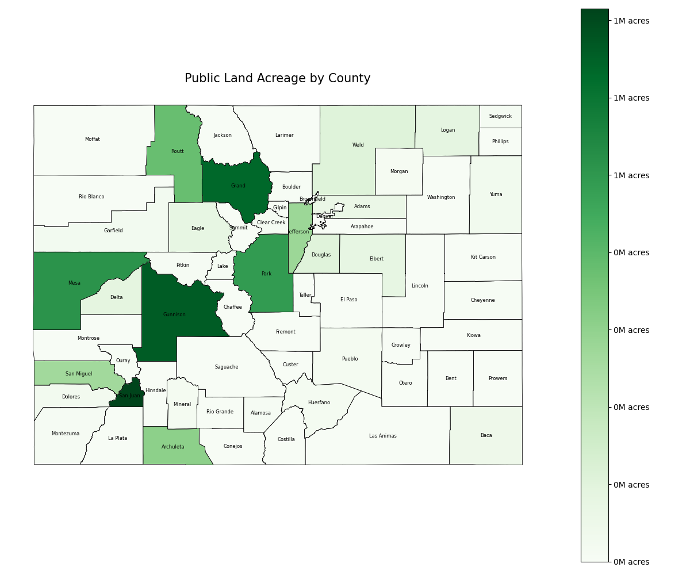

### Introduction

This project analyzes land ownership patterns across the state of Colorado, with the goal of visualizing:

- The balance between publicly and privately owned land
- How private land is distributed among:
  - Individuals  
  - Trusts  
  - Corporations and other entities

By mapping and classifying land ownership, this project aims to highlight trends related to land control, equity, and conservation.

This project was developed with the assistance of AI tools to enhance research, streamline analysis, and improve code development efficiency.

---

## Methodology

## Datasets Used

The analysis combines two key datasets:

1. **Colorado Statewide Parcel Composite**  
   Provided by the Colorado Governor’s Office of Information Technology, this dataset contains parcel-level data for most Colorado counties, including acreage, land use, and ownership type.

2. **Colorado Ownership, Management, and Protection (COMaP)**  
   Maintained by the Colorado Natural Heritage Program, this dataset provides polygon-level data for publicly managed and conserved lands. It complements the parcel composite by filling in missing acreage values and identifying protected private lands.

## Tools and Libraries

This project was built using Python and the following libraries:

- `pandas` – for working with tabular data  
- `geopandas` – for geospatial operations on shapefiles  
- `fiona` and `pyogrio` – for reading geospatial files  
- `matplotlib` and `seaborn` – for visualizations

---

## Limitations

There are several important caveats to this analysis:

- The 2024 Statewide Parcel Composite:
  - Excludes certain counties due to missing data  
  - Contains unreliable or inconsistent acreage values in some entries

- The COMaP dataset:
  - Is not parcel-based  
  - Includes protected private lands that may overestimate public land totals

These limitations are acknowledged throughout the analysis and accounted for in the interpretation of the visual results.

### Results

### Public vs. Private Land in Colorado

According to the statewide parcel dataset, approximately **62.6% of Colorado land is privately owned**, while **37.4% is publicly owned**.

This division highlights the significant presence of public lands — including federal, state, and local management — but also reflects the dominant role of private property in shaping the state's landscape.

---

### Breakdown of Private Land Ownership

Within privately held land, the majority is owned by **individuals**. Other significant holders include:

- **Companies** (LLCs, corporations)
- **Trusts**
- A smaller share classified as **Unknown**

This breakdown helps illustrate not just how much land is privately owned — but **who** holds it and in what form.

*Note: Y-axis values are shown in scientific notation (e.g., `1e8` = 100,000,000 acres) to keep the charts readable given the scale of land ownership.*

## Land Ownership by County

### Public Land Acreage by County

Public lands are concentrated in the mountainous western and central counties.  
Counties such as **Gunnison, San Juan, San Miguel, Park, Delta, and Mesa** show strong public land holdings based on total acreage.

---

### Private Land Acreage by County

This map reveals that several eastern Colorado counties — including **Morgan, Washington, Lincoln, and Kit Carson** — have some of the largest areas of privately held land.

Urban counties like **Denver, Boulder, and Arapahoe** show lighter shading, reflecting lower total acreage due to higher population density and smaller parcel sizes.

*Note: Counties such as **Rio Blanco** and **El Paso** were excluded due to unreliable acreage values that skewed the results.*
## Colorado Land Ownership by Type

This map uses COMaP data to visualize who manages conserved and protected lands across the state.

- **USFS (U.S. Forest Service)** and **BLM (Bureau of Land Management)** control the majority of public lands, especially in the western and central regions of Colorado.
- **Privately conserved land** appears more frequently on the Eastern Plains, where land trusts and conservation easements have been applied.
- **State-managed lands** are scattered but visible near state parks and urban centers.
- **County, city, and NGO-managed parcels** tend to cluster in metro areas and along the Front Range.

> Note: The categories "Private" and "Private Conservation" both represent conserved private lands, but may differ by the method of conservation — such as **fee-title ownership** versus a **conservation easement**.

## Case Study: Gunnison County

Gunnison County is my home base and serves as the focus of this additional case study. Nestled in the heart of the Colorado Rockies, Gunnison is often cited as one of the most public land-dominated counties in the state.

This portion of the analysis uses data from the **Gunnison County Assessor's Office** combined with statewide public land data to better understand how ownership plays out at the county level.

### Land Ownership in Gunnison County

Over **76% of the land in Gunnison County is publicly owned**, with the majority held by federal agencies such as the **U.S. Forest Service (USFS)** and the **Bureau of Land Management (BLM)**. The map below visualizes how public and private lands are distributed within the county.

---

### Land Ownership by Acreage and Parcel Count

The chart below compares **public vs. private land** in Gunnison by total acreage, while also breaking down **parcel ownership** between local and out-of-town residents.

- Public lands dominate the landscape, accounting for approximately **76.1%** of the total land.
- Among private parcels, **out-of-town owners control more acreage and more parcels than local residents**.
- This pattern suggests a broader trend of **external investment** in large ranches, vacation homes, and speculative land purchases.

---

### Out-of-Town Ownership Trends

Out-of-town land ownership is a defining feature of the Gunnison property market.

- **4,878 parcels** are owned by individuals who live elsewhere in Colorado.
- **Texas** ranks highest among out-of-state buyers, with over **2,700 parcels**.
- Other leading states include **Florida, California, Oklahoma**, and several in the Midwest and West.

---

### Colorado-Based Out-of-Town Owners

Among out-of-town owners who still live within Colorado, the most common cities of origin are:

- **Denver** – 526 parcels  
- **Grand Junction** – 405  
- **Montrose** – 358  
- **Colorado Springs** – 275  

These cities are either population hubs or within driving distance of Gunnison, indicating that **access to recreation** and vacation property likely influence ownership.

---

### Why So Much Out-of-Town Ownership?

Several factors contribute to the high rate of out-of-town property ownership:

- **Tourism and Second Homes**: Crested Butte ski area, wilderness, and recreation draw seasonal residents.
- **Low Population Density**: A small local population makes it easier for outside buyers to dominate the market.
- **Wealth & Investment Trends**: Gunnison is more affordable than other resort regions, attracting buyers seeking land banking, ranches, or development potential.
- **Barriers for Local Buyers**: Rising land prices and competition from cash offers limit local access to land ownership.

---

### Breakdown of Ownership Type in Gunnison County

The chart below shows how property is held according to classification in the county assessor data.

- **Individual owners** hold over **13,000 parcels**, indicating a strong presence of privately managed land.
- **LLCs and corporations** own nearly **6,000 parcels**, highlighting commercial or investment activity.
- **Trusts** hold more than **2,000 parcels**, often linked to estate planning or generational wealth transfer.
- A small number of parcels are held under **estates**, typically in transition or probate.

These patterns suggest a growing trend of **formalized and consolidated land control**, especially through LLCs and trusts, while individual ownership remains the most common structure. The implications for land use, equity, and policy are significant for rural counties like Gunnison.

---

## Conclusion

This project explored patterns of land ownership across Colorado, combining geospatial analysis with assessor data to reveal the balance between public and private land.

Key takeaways include:

- Approximately **37.4% of Colorado land is publicly owned**, while **62.6% is privately held**.
- **Public lands** are concentrated in the mountainous western regions, while **private ownership dominates the Eastern Plains**.
- Among private landowners, **individuals remain the largest group**, but a significant share is held by **LLCs, trusts, and corporations**.
- A case study of **Gunnison County** reveals that **out-of-town owners control more private land than locals**, with buyers coming from across Colorado and other states like Texas and Florida.

These trends reflect broader shifts in **land access, wealth concentration, and conservation strategy** — all of which have long-term implications for planning, equity, and the future of Colorado's landscapes.

